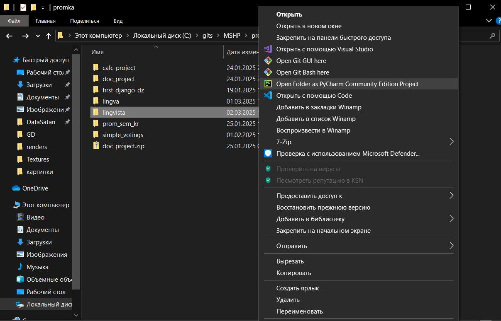
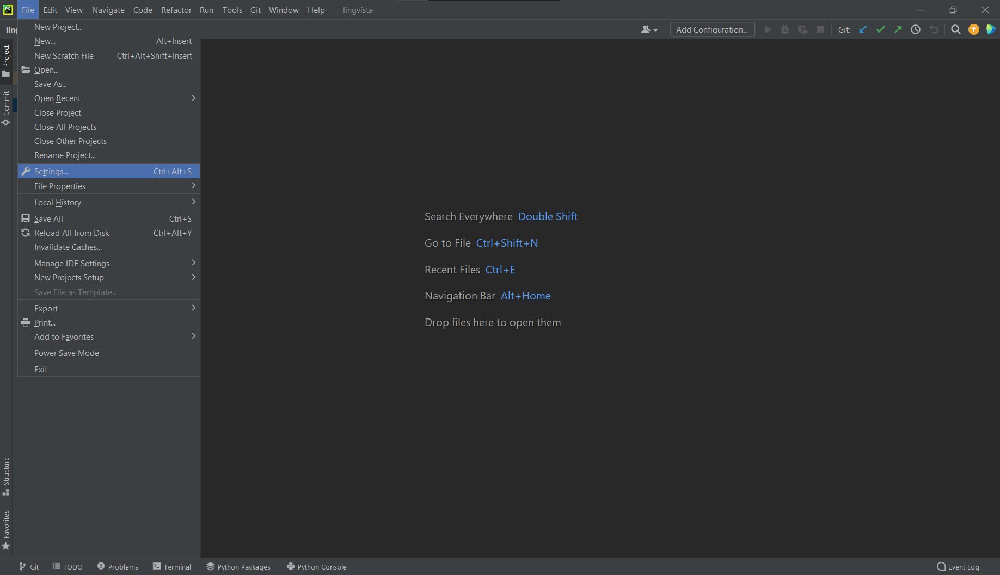
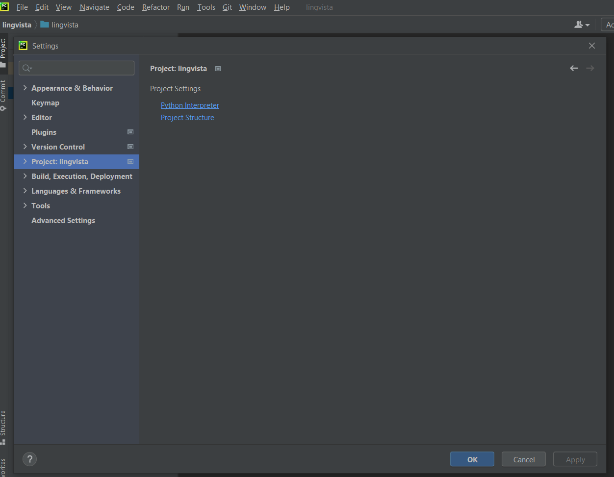
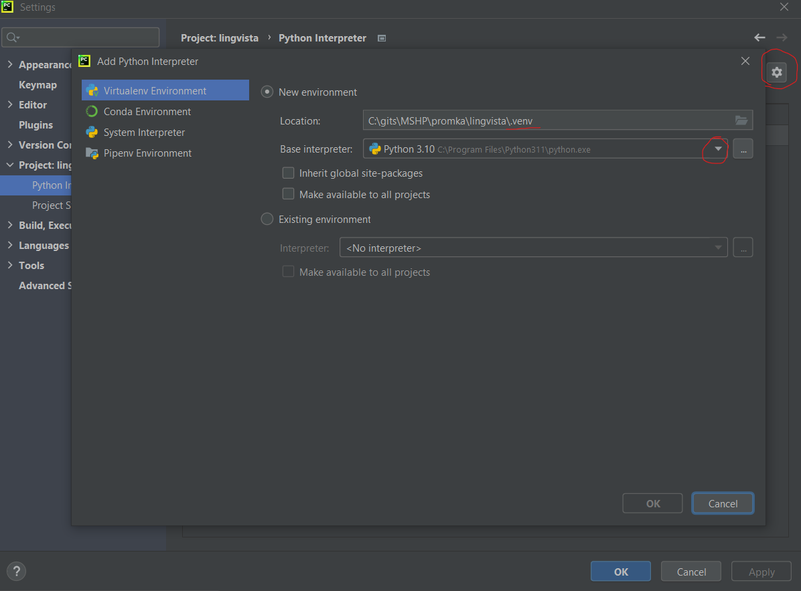
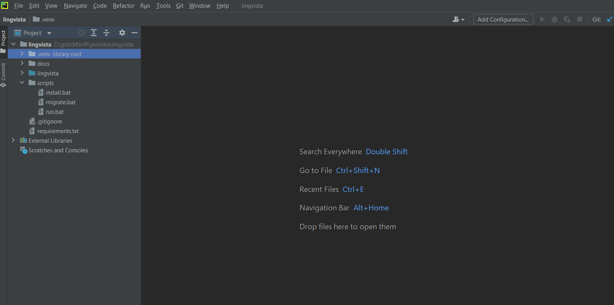
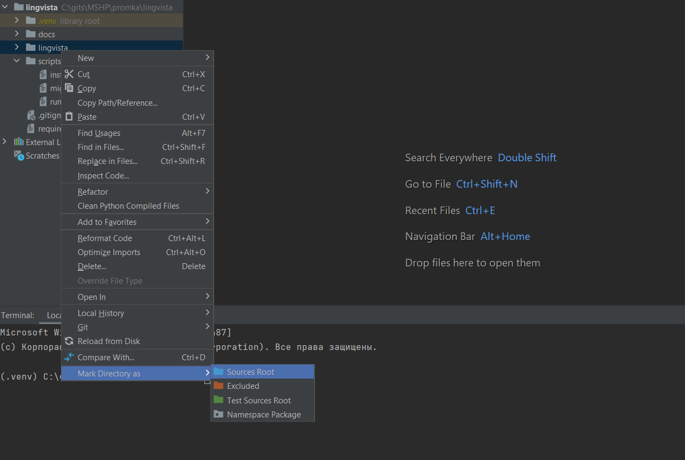
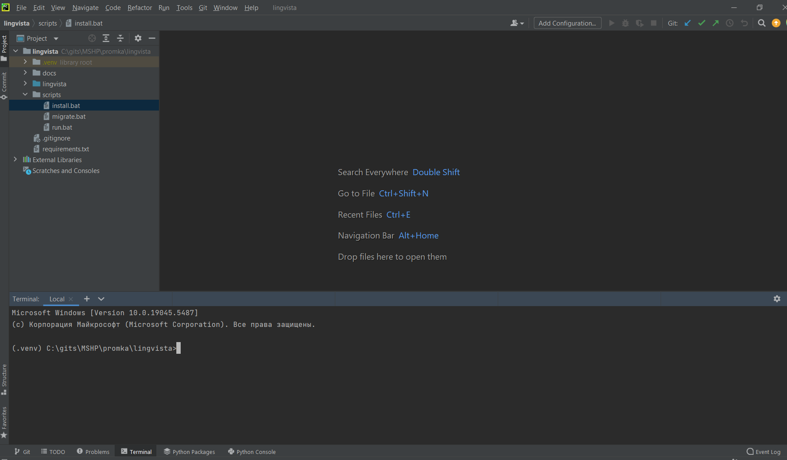
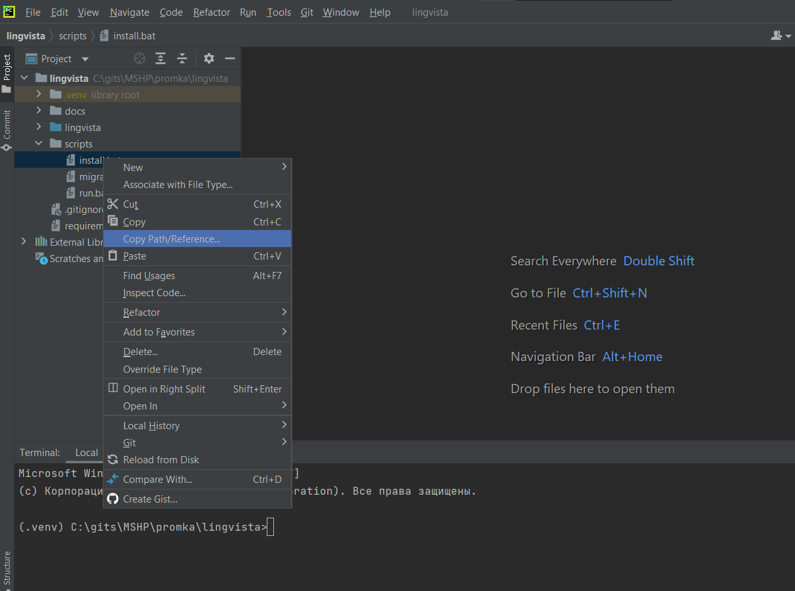
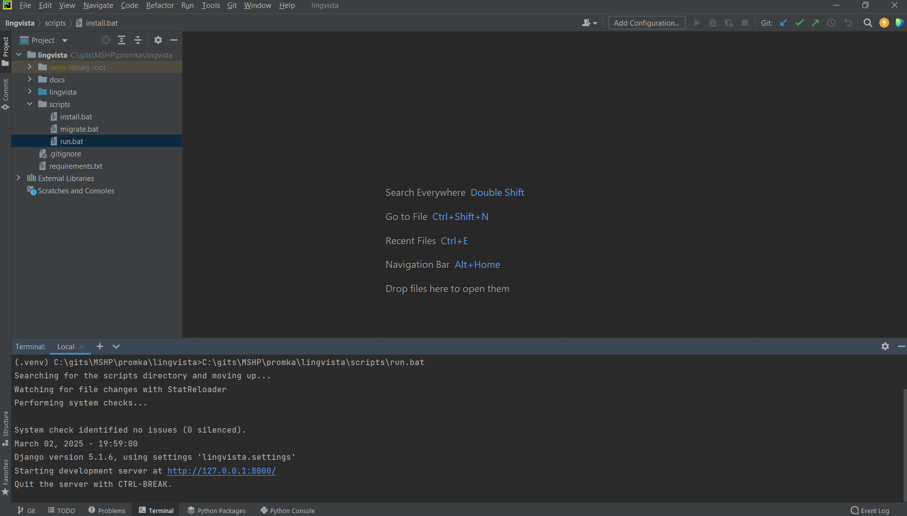

# Lingvista Project

Эта инструкция написана для работы с платформой Windows. Для его запуска потребуется установить несколько инструментов и выполнить ряд шагов.

## Требования

Для запуска проекта на платформе Windows потребуется:

- **Git Bash** ([скачать Git Bash](https://git-scm.com/downloads))
- **PyCharm Community Edition** ([скачать PyCharm](https://www.jetbrains.com/ru-ru/pycharm/download/?section=windows))
- **Python 3.10+** ([скачать Python](https://www.python.org/downloads/))

## Первый запуск

### 1. Скачивание репозитория

1.1 Откройте проводник в месте, где хотите создать проект. Нажмите правой кнопкой мыши на пустую область и выберите пункт **"Open Git Bash here"**.


1.2 Введите команду для клонирования репозитория:

```bash
git clone https://gitlab.informatics.ru/2024-2025/vk/s107/lingvista.git
```

и начнется его скачивание.


Если скачивание не произошло, вероятно появится ошибка "fatal: destination path 'lingvista' already exists and is not an empty directory." Это значит что такая директория с проектом у вас существует, требуется скачать проект в другую папку, например в lingvista2:

```bash
git clone https://gitlab.informatics.ru/2024-2025/vk/s107/lingvista.git lingvista2
```


## 2. Создать проект в PyCharm

### 2.1 Создание проекта из директории
Создайте проект из созданной директории `lingvista` (или `lingvista2`). Это можно сделать, нажав на папку правой кнопкой мыши и выбрав пункт **"Open folder as PyCharm Community Edition Project"**.



### 2.2 Добавление виртуального окружения
Откроется окно проекта в PyCharm. Добавьте в проект виртуальное окружение. Для этого откройте первую вкладку **File** и выберите пункт **Settings...**.



### 2.3 Настройка интерпретатора
В открывшемся окне выберите слева пункт **"Project: lingvista"** и в подокне ссылку **"Python Interpreter"**.



### 2.4 Создание виртуального окружения
В окне создайте новое виртуальное окружение на базе одного из имеющихся интерпретаторов: нажмите на шестеренку и в новом окне выберите базовый интерпретатор и укажите его в корневой папке проекта в папке `.venv` (обычно PyCharm предлагает сам этот путь).



### 2.5 Завершение настройки
Нажмите кнопку **"OK"**, дождитесь, когда виртуальное окружение создастся, и закройте ранее открытые окна с настройками проекта. При удачной настройке появится папка `.venv` в корне проекта.



### 2.6 Добавление папки как "source root"
Для удобства рекомендуется добавить подпапку проекта **"lingvista"** как **"source root"**, тогда не будет проблем с подсветкой импорта ряда модулей внутри проекта.



## 3. Добавление зависимостей в проект и первый запуск

### 3.1 Открытие терминала
В окне PyCharm откройте окно с терминалом. В нем должно отображаться, что вы находитесь в виртуальном окружении (появится подпись **"(.venv)"** перед текущим путем).



### 3.2 Установка зависимостей
Скопируйте полный путь для скрипта `install.bat` (откройте папку `scripts`, нажмите правой кнопкой мыши на файл `install.bat`, выберите пункт **Copy Path/Reference** и выберите **Absolute Path**). Вставьте его в терминал, нажмите **Enter** и дождитесь, когда все зависимости будут установлены.



### 3.3 Запуск проекта
Аналогично скопируйте путь до скрипта `run.bat`, вставьте в терминал и нажмите **Enter**. Должен подняться сервер с проектом по адресу [http://127.0.0.1:8000/](http://127.0.0.1:8000/).



### Вы великолепны!
