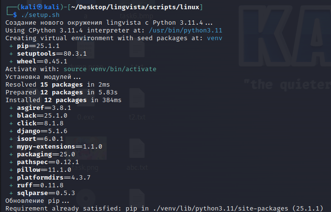

# Lingvista Project
## Содержание
- [Описание проекта](#description)
- [Запуск проекта](#run)
  - [Windows](#windows)
    - [Требования](#win_requirements)
    - [Скачивание репозитория](#win_download)
    - [Настройка при помощи скриптов](#win_install)
    - [Запуск](#win_run)
    - [Типичные проблемы](#win_troubles)
  - [Linux](#linux)
    - [Требования](#linux_requirements)
    - [Скачивание репозитория](#linux_download)
    - [Настройка при помощи скриптов](#linux_install)
    - [Запуск](#linux_run)
    - [Типичные проблемы](#linux_troubles)
- [Участники](#members)

<a id="description"></a>
## Описание проекта
Сайт для изучения русского языка.  
[Техническое задание](https://docs.google.com/document/d/1QOcBT0_dpKqNCYbxWRafvuqcmZl5DztV8opJqeo9mX8/edit?tab=t.0)

[Дизайн фигма](https://www.figma.com/design/q9LbJSccNxa4lZGnteVSCf/Lingvista?node-id=0-1&p=f&t=EVKqCsyXKCClFQG6-0)

<a id="run"></a>
## Запуск проекта

<a id="windows"></a>
### Windows
<a id="win_requirements"></a>
#### Требования
- **Git** (Например, Git Bash [скачать](https://git-scm.com/downloads))

- **UV** (установка через [скрипт](#win_install) используя [winget](https://github.com/microsoft/winget-cli/releases), [сайт проекта](https://docs.astral.sh/uv/))

<a id="win_download"></a>
#### Скачивание репозитория
1. Откройте проводник в месте, где хотите создать проект. Нажмите правой кнопкой мыши на пустую область и выберите пункт **"Open Git Bash here"**.


2. Введите команду для клонирования репозитория:

```bash
git clone https://gitlab.informatics.ru/2024-2025/vk/s107/lingvista.git
```

и начнется его скачивание.


Если скачивание не произошло, вероятно появится ошибка "fatal: destination path 'lingvista' already exists and is not an empty directory." Это значит что такая директория с проектом у вас существует, требуется скачать проект в другую папку, например в lingvista2:

```bash
git clone https://gitlab.informatics.ru/2024-2025/vk/s107/lingvista.git lingvista2
```


<a id="win_install"></a>
#### Настройка при помощи скриптов
Откройте командную строку в корне репозитория и перейдите в папку scripts\windows
```cmd
cd scripts\windows
```
Если менеджер окружений UV еще не установлен, то установите его вызвав скрипт
```cmd
.\install-third-party.bat
```
Вызовите скрипт для создания окружения и установки всех необходимых зависимостей
```cmd
.\setup.bat
```

<a id="win_run"></a>
#### Запуск
- Откройте командную строку в корне репозитория и перейдите в папку scripts\windows
```cmd
cd scripts\windows
```
- Для запуска сервера
```cmd
.\run.bat
```
- Для запуска linter и других утилит (для вызова справки запустите с ключом -Help)
```cmd
.\check.bat
```

<a id="win_troubles"></a>
#### Типичные проблемы
Если UV не устанавливается, возможно, проблема в правах. Запустите командную строку от имени администратора. Альтернативные способы описаны [тут](https://docs.astral.sh/uv/#installation)

<a id="linux"></a>
### Linux

<a id="linux_requirements"></a>
#### Требования
- **Git** (apt install git)
- **UV** (установка через [скрипт](#linux_install) используя curl, [сайт проекта](https://docs.astral.sh/uv/))

<a id="linux_download"></a>
#### Скачивание репозитория
1. Откройте терминал в месте, где хотите создать проект.

2. Введите команду для клонирования репозитория:

```bash
git clone https://gitlab.informatics.ru/2024-2025/vk/s107/lingvista.git
```

и начнется его скачивание.

Если скачивание не произошло, вероятно появится ошибка "fatal: destination path 'lingvista' already exists and is not an empty directory." Это значит что такая директория с проектом у вас существует, требуется скачать проект в другую папку, например в lingvista2:

```bash
git clone https://gitlab.informatics.ru/2024-2025/vk/s107/lingvista.git lingvista2
```

<a id="linux_install"></a>
#### Настройка при помощи скриптов
Откройте терминал в корне репозитория и перейдите в папку scripts/linux
```bash
cd scripts/linux
```
Если менеджер окружений UV еще не установлен, то установите его вызвав скрипт
```bash
./install-third-party.sh
```
Перезапустите терминал, чтобы все изменения применились.
Вызовите скрипт для создания окружения и установки всех необходимых зависимостей
```bash
./setup.sh
```

<a id="linux_run"></a>
#### Запуск
- Откройте командную строку в корне репозитория и перейдите в папку scripts/windows
```bash
cd scripts/windows
```
- Для запуска сервера
```bash
./run.sh
```

- Для запуска linter и других утилит (для вызова справки запустите с ключом --help)
```bash
./check.sh
```
<a id="linux_troubles"></a>
#### Типичные проблемы
- При установке UV, необходимо добавить в переменную пути расположение UV. В скрипте это делается, но он может несработать.
Проверьте, появился ли UV, вызвав
```bash
uv --help
```
Если команда не найдена, проверьте наличие UV по адресу стандартного места установки
```bash
ls "$HOME/.local/bin"
```
Если он там есть, то необходимо добавьте путь $HOME/.local/bin в переменную путей окружения
```bash
export PATH="$HOME/.local/bin:$PATH"
```
- Если при вызове setup.sh выводится сообщение об отсутствии UV и прошли этап с установкой install-third-party.sh


Если установка UV не удается, попробуйте альтернативные способы, они описаны [тут](https://docs.astral.sh/uv/#installation)

### Вы великолепны!


<a id="members"></a>
## Участники
### Frontend
- Латун Иван - тимлид
- Шведов Фёдор
- Самофалов Константин

### Backend
- Наумов Марк - тимлид
- Кулешов Степан
- Сухорукова Мария
