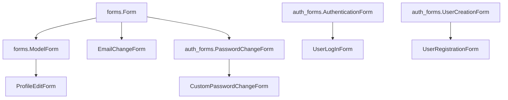

# Формы (forms.py)

В этом разделе описаны все Django-формы, используемые в проекте Lingvista.

---

## Формы профиля

### `ProfileEditForm`
- **Назначение**: Редактирование фото профиля
- **Родительский класс**: `forms.ModelForm`
- **Модель**: `Profile`
- **Поля**:
  - `profile_photo` (с кастомным виджетом `CustomClearableFileInput`)
- **Стили**: Использует класс `input-custom` для стилизации

### `EmailChangeForm`
- **Назначение**: Изменение email пользователя
- **Родительский класс**: `forms.Form`
- **Поля**:
  - `email` (EmailField)
    - Виджет: `EmailInput` с классом `input-custom`
    - Лейбл: "New Email"

### `CustomPasswordChangeForm`
- **Назначение**: Изменение пароля пользователя
- **Родительский класс**: `PasswordChangeForm`
- **Особенности**:
  - Автоматически добавляет класс `input-custom` ко всем полям формы
  - Наследует всю валидацию паролей от Django

---

## Формы аутентификации

### `UserLogInForm`
- **Назначение**: Авторизация пользователя
- **Родительский класс**: `AuthenticationForm`
- **Поля**:
  - `username`:
    - Виджет: `TextInput` с классом `form-input`
    - Плейсхолдер: "Username"
  - `password`:
    - Виджет: `PasswordInput` с классом `form-input`
    - Плейсхолдер: "Password"

### `UserRegistrationForm`
- **Назначение**: Регистрация нового пользователя
- **Родительский класс**: `UserCreationForm`
- **Поля**:
  - `username`:
    - Виджет: `TextInput` с классом `form-input`
    - Плейсхолдер: "Username"
  - `email` (обязательное поле):
    - Виджет: `EmailInput` с классом `form-input`
    - Плейсхолдер: "Your Email"
  - `password1`:
    - Виджет: `PasswordInput` с классом `form-input`
    - Плейсхолдер: "Password"
  - `password2`:
    - Виджет: `PasswordInput` с классом `form-input`
    - Плейсхолдер: "Password confirmation"

---

## Кастомизация форм

Все формы используют кастомные стили через CSS-классы:
- `input-custom` - для форм профиля
- `form-input` - для форм аутентификации

Форма `ProfileEditForm` использует кастомный виджет `CustomClearableFileInput` для загрузки изображений.

---

## Схема наследования форм

### Базовые классы Django

| Класс | Описание |
|-------|----------|
| `forms.Form` | Базовая форма Django |
| `forms.ModelForm` | Форма для работы с моделями |
| `auth_forms.*` | Стандартные формы аутентификации Django |

### Кастомные формы проекта

| Форма | Назначение |
|-------|------------|
| `ProfileEditForm` | Редактирование профиля пользователя |
| `EmailChangeForm` | Изменение email пользователя |
| `CustomPasswordChangeForm` | Смена пароля с дополнительной валидацией |
| `UserLogInForm` | Форма авторизации пользователей |
| `UserRegistrationForm` | Регистрация новых пользователей |

Эта документация полностью описывает все формы проекта, включая их назначение, структуру и особенности реализации.
